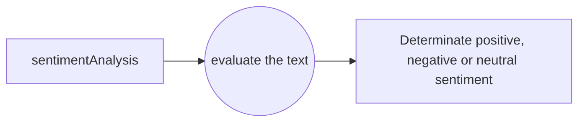

🤖 Sentiment Analysis Challenge: Can You Decode the Feeling?
==============

  

Welcome to the second challenge of boothack community 🥳 👋🏻 

In this challenge, you'll learn how to analyze the emotional tone of text using JavaScript. It's a fun way to dip your toes into the world of Natural Language Processing (NLP) 🧠.
  

**The Goal:** 🎯
==============

Imagine you're building a tool to analyze customer feedback or social media posts - that's where sentiment analysis comes in handy!

Your mission is to create a  `sentimentAnalysis(text)`  function that determines whether a given piece of text expresses a  **positive**,  **negative**, or  **neutral**  sentiment.

-  **`sentimentAnalysis(text):** This function should determinate if the text is positive, negative or neutral
  
  The Tools:

-   **JavaScript:**  Your trusty programming language.
-   **Logic:**  You'll need to implement a basic sentiment analysis algorithm. 🤔
-   **Creativity:**  You can use a pre-defined list of positive and negative words, or get creative and come up with your own! 💡

**Flow Diagram:** 🔁
==============

  

  

**Instructions:** 📝
==============

 

1.  **Create the  `sentimentAnalysis(text)`  Function:**
    
    -   This function will take a string of text as input.
    -   It should return one of the following strings: "Positive," "Negative," or "Neutral."
2.  **Implement a Simple Sentiment Analysis Algorithm:**
    
    -   You can use a basic approach that counts the number of positive and negative words in the text.
    -   If positive words outweigh negative words, it's "Positive."
    -   If negative words outweigh positive words, it's "Negative."
    -   If they're equal or both are low, it's "Neutral."

3.  **Build a Test Suite:** 🧪
    
    -   Write a few test cases to make sure your function works correctly.
    -   Test with sentences expressing positive, negative, and neutral sentiments.

4.  **Bonus points:** 🌟

-   **Advanced Techniques:**  For a more sophisticated approach, research other NLP techniques like sentiment lexicons, machine learning models, or APIs that provide sentiment analysis services.
-   **User Interface:**  Create a simple user interface (UI) with HTML and CSS to allow users to input text and see the sentiment analysis results.

	- Suscribe to the discord community 👉🏻 https://discord.gg/6YZGTxSFUX

  

**How to provide your challenge solution:** 📦
==============

  

1. Join the community: If you haven't already, join our Discord/Forum to share your progress and get feedback.

2.  Create a repository on GitHub and push your code.

3.  Include your  `sentimentAnalysis`  function, test cases, and any UI elements you created.

4. Upload your solution: Send your repository code link in a PR to the GitHub Challenge repo or via private message to Gonzalo (on discord) before 17 December .

5. (optional) Share your experience: Post your progress on social media using the hashtag #RetoCodigoBootHack so we can see you in action and mention @boothackTV.

**What can you win?** 🎁
==============

As well as improving your skills and connecting with our amazing community, we have some great prizes up for grabs! 👇

🥇 **Best Code award**: Linkedin post congratulating on the work delivered 🌟

🥈 **Best UI award:** 1:1 Individual Coaching with @gonzalogcontacto (community founder)
